# EAP Bot — System Architecture Diagram (Mermaid)

## How to use
1. **LucidChart**: Go to `File → Import Data → Mermaid` and paste the code block below.
2. **Mermaid Live**: Go to [mermaid.live](https://mermaid.live) and paste the code block.

---

## Mermaid Code

```mermaid
flowchart TD
    %% ── External Actors ──
    LLM["🤖 LLM Backend\n(Groq / Gemini / Ollama / Mistral)"]
    USER["👤 User / Client"]
    STORAGE[("💾 Storage Layer\n(File System + JSON)")]
    VECTOR[("🔍 FAISS VectorStore\n(Embeddings)")]

    %% ── User connects to feature groups ──
    USER -->|Projects| PM
    USER -->|Documents| DA
    USER -->|Q&A| QA
    USER -->|Mapping| MAP
    USER -->|Testing| TC
    USER -->|Code Gen| CG
    USER -->|System| SYS

    %% ════════════════════════════════════════
    %% PROJECT MANAGEMENT
    %% ════════════════════════════════════════
    subgraph PM["📁 Project Management"]
        direction TB
        PM_CREATE["Create Project"]
        PM_LIST["List Projects"]
        PM_LOAD["Load Project"]
        PM_UPDATE["Update Project"]
        PM_DELETE["Delete Project"]
        PM_REANALYZE["Re-Analyze Project"]
        PM_DETAILS["Get Project Details"]
    end

    PM_CREATE --> STORAGE
    PM_LIST --> STORAGE
    PM_LOAD --> STORAGE
    PM_UPDATE --> STORAGE
    PM_DELETE --> STORAGE
    PM_REANALYZE --> DA_ANALYZE
    PM_DETAILS --> STORAGE

    %% ════════════════════════════════════════
    %% DOCUMENT ANALYSIS
    %% ════════════════════════════════════════
    subgraph DA["📄 Document Analysis"]
        direction TB
        DA_UPLOAD["Upload Document\n(.pdf / .xlsx / .txt / .log)"]
        DA_ANALYZE["Analyze Document"]
        DA_PARSE["Parse Document\n(PyMuPDF / PyPDF / openpyxl)"]
        DA_EXTRACT["Extract Equipment Spec\n(LLM Chunk Extraction)"]
        DA_TABLES["Extract Tables\n(pdfplumber → CSV → LLM)"]
        DA_MERGE["Merge & Validate Spec\n(SpecValidator)"]
        DA_REPORTS["Generate Reports\n(ReportService)"]
        DA_SAVE["Save EquipmentSpec.json"]
        DA_INDEX["Index Text in VectorStore"]
        DA_QA_GEN["Generate Predefined Q&A"]
        DA_GET_VAR["Get Variables"]
        DA_DEL_DOC["Delete Document"]
        DA_UPDATE["Update Extraction"]
    end

    DA_UPLOAD --> DA_PARSE
    DA_UPLOAD --> STORAGE
    DA_UPLOAD --> DA_INDEX
    DA_ANALYZE --> DA_PARSE
    DA_PARSE --> DA_EXTRACT
    DA_PARSE --> DA_TABLES
    DA_EXTRACT --> LLM
    DA_TABLES --> LLM
    DA_EXTRACT --> DA_MERGE
    DA_TABLES --> DA_MERGE
    DA_MERGE --> DA_REPORTS
    DA_REPORTS --> LLM
    DA_MERGE --> DA_SAVE
    DA_REPORTS --> DA_SAVE
    DA_SAVE --> STORAGE
    DA_INDEX --> VECTOR
    DA_SAVE --> DA_QA_GEN
    DA_QA_GEN --> LLM
    DA_QA_GEN --> VECTOR
    DA_GET_VAR --> STORAGE
    DA_DEL_DOC --> STORAGE
    DA_DEL_DOC --> VECTOR
    DA_UPDATE --> STORAGE

    %% ════════════════════════════════════════
    %% INTELLIGENT QA
    %% ════════════════════════════════════════
    subgraph QA["💬 Intelligent Q&A"]
        direction TB
        QA_ASK["Ask Question"]
        QA_SEARCH["Semantic Search\n(multi-category)"]
        QA_ANSWER["Generate Answer\n(QAService)"]
        QA_CAT["Get Knowledge Categories"]
    end

    QA_ASK --> QA_SEARCH
    QA_SEARCH --> VECTOR
    QA_SEARCH --> QA_ANSWER
    QA_ANSWER --> LLM
    QA_CAT --> STORAGE

    %% ════════════════════════════════════════
    %% MES MAPPING
    %% ════════════════════════════════════════
    subgraph MAP["🔗 MES Mapping"]
        direction TB
        MAP_FAMILIES["Get / Update\nMES Families"]
        MAP_TEMPLATES["Get / Add / Update\nMES Templates"]
        MAP_AUTO["AutoMap\n(Vector + LLM Rerank)"]
        MAP_SAVE["Save Mapping\n(UpdateMapping)"]
        MAP_COSINE["Cosine Similarity\nEntity Embeddings"]
        MAP_RERANK["LLM Rerank\n(ambiguous matches)"]
    end

    MAP_FAMILIES --> STORAGE
    MAP_TEMPLATES --> STORAGE
    MAP_AUTO --> MAP_COSINE
    MAP_COSINE --> VECTOR
    MAP_COSINE --> MAP_RERANK
    MAP_RERANK --> LLM
    MAP_AUTO --> MAP_SAVE
    MAP_SAVE --> STORAGE

    %% ════════════════════════════════════════
    %% TOOL CHARACTERIZATION
    %% ════════════════════════════════════════
    subgraph TC["🧪 Tool Characterization"]
        direction TB
        TC_GEN_TEST["Generate Test Scripts\n(SML → JSON)"]
        TC_UPDATE["Update Script"]
        TC_GEN_SML["Generate SML Scripts\n(SMLGenerationService)"]
        TC_UPLOAD_RES["Upload Test Results\n(Test / SECS Log)"]
        TC_GET_RES["Get Tool Results"]
    end

    TC_GEN_TEST --> STORAGE
    TC_UPDATE --> STORAGE
    TC_GEN_SML --> STORAGE
    TC_UPLOAD_RES --> STORAGE
    TC_GET_RES --> STORAGE

    %% ════════════════════════════════════════
    %% CODE GENERATION
    %% ════════════════════════════════════════
    subgraph CG["⚡ Code Generation"]
        direction TB
        CG_GENERATE["Generate C# Constants\n(SmartAutomationService)"]
        CG_UPDATE["Update Code"]
        CG_REPORT["Generate Overall Report"]
    end

    CG_GENERATE --> STORAGE
    CG_UPDATE --> STORAGE
    CG_REPORT --> STORAGE

    %% ════════════════════════════════════════
    %% SYSTEM
    %% ════════════════════════════════════════
    subgraph SYS["⚙️ System"]
        direction TB
        SYS_HEALTH["Health Check"]
        SYS_SUMMARY["System Summary"]
        SYS_ENDPOINT["Endpoint Info\n(OpenAPI Introspection)"]
    end

    SYS_SUMMARY --> STORAGE

    %% ── Styling ──
    classDef actor fill:#4A90D9,stroke:#2C5F8A,color:#fff,font-weight:bold
    classDef infra fill:#6C5CE7,stroke:#4B3BAF,color:#fff,font-weight:bold
    classDef group fill:#F8F9FA,stroke:#343A40,color:#343A40
    classDef action fill:#FFFFFF,stroke:#343A40,color:#1A1A1A

    class USER,LLM actor
    class STORAGE,VECTOR infra
```

> [!TIP]
> After pasting into LucidChart, use **Auto Layout** (Arrange → Auto Layout → Tree/Hierarchical) to get a clean layout similar to the reference image.
